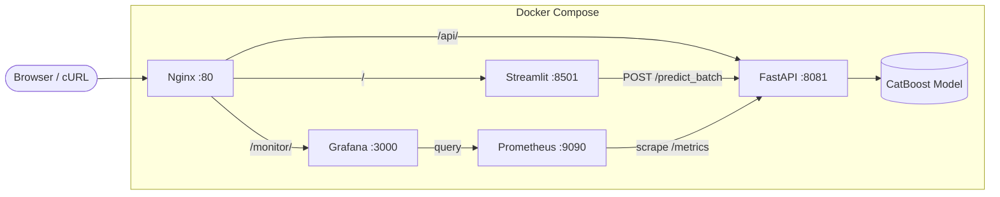

# MLE Project — Real Estate Price Prediction

This project is a production-ready Machine Learning service for predicting real estate prices. It is designed to be deployed on **AWS EC2** using **Docker Compose** for a unified, scalable environment.

## 🚀 Features

*   **ML Prediction Model**: Trained on real estate data (CatBoost / Linear Regression) to estimate property prices based on features like area, room count, and building year.
*   **Streamlit UI**: A user-friendly web interface for uploading CSV files and getting batch predictions with interactive data visualization.
*   **FastAPI Backend**: A robust REST API serving the model, supporting both single-item and batch predictions.
*   **Monitoring Stack**: Integrated **Prometheus** and **Grafana** for validating model performance and system health in real-time.
*   **Nginx Reverse Proxy**: Single entry point (Port 80) routing traffic to all services securely.

## 🏗️ Architecture



## 📂 Project Structure

```
mle-project-sprint-3-v001/
├── docker-compose.yml          # Orchestrates all services
├── nginx.conf                  # Reverse proxy configuration
├── .env                        # Environment variables (credentials)
│
├── frontend/                   # Streamlit Web UI
│   ├── Dockerfile
│   ├── app.py                  # Main Streamlit application
│   └── requirements.txt
│
├── services/                   # Backend API + ML Model
│   ├── Dockerfile
│   ├── requirements.txt        # Python dependencies (pinned)
│   ├── ml_service/             # Core application package
│   │   ├── handler.py          # Model loading & prediction logic
│   │   └── predict_price.py    # FastAPI routes & Prometheus metrics
│   ├── models/model/           # Trained model artifact (model.pkl)
│   └── prometheus/
│       └── prometheus.yml      # Prometheus scrape config
│
├── imitation.py                # Load-test script (generates traffic)
├── generate_drift_data.py      # Generates sample CSV with drift/errors
├── sample_data.csv             # Normal sample data for batch prediction
├── sample_data_drift.csv       # Drift sample data for testing
├── test_api.sh                 # Shell script for API smoke tests
├── dashboard.json              # Grafana dashboard export
├── dashboard.jpg               # Grafana dashboard screenshot
│
├── README.md                   # This file
├── Instructions.md             # API usage guide with cURL examples
└── Monitoring.md               # Dashboard metrics documentation
```

## 🛠️ Tech Stack

*   **Language**: Python 3.10
*   **ML Framework**: Scikit-Learn / CatBoost / MLflow
*   **Web**: FastAPI (Backend), Streamlit (Frontend), Nginx
*   **DevOps**: Docker, Docker Compose, AWS EC2
*   **Monitoring**: Prometheus, Grafana

## 📦 Services

| Service | Port (Internal) | URL (Public via Nginx) | Description |
| :--- | :--- | :--- | :--- |
| **Frontend** | `8501` | `http://<HOST>/` | Main Web UI |
| **Backend** | `8081` | `http://<HOST>/api/docs` | API Documentation (Swagger) |
| **Grafana** | `3000` | `http://<HOST>/monitor/` | Monitoring Dashboards (Login: `admin`/`admin`) |
| **Prometheus** | `9090` | internal only | Metrics Collection |

## 🚦 How to Run

### 1. Start All Services
```bash
docker compose up -d --build
```
> **Note:** Run this command from the project root without specifying a service name to launch the full stack (Frontend, Backend, Monitoring).

### 2. Access the Application
Open your browser and navigate to `http://localhost/` (or your EC2 Public IP).

## 📡 API Usage & Integration

The service exposes a JSON API for programmatic access.
For detailed `curl` examples and integration guides, see **[Instructions.md](Instructions.md)**.

## 📊 Monitoring

The system includes a Prometheus + Grafana monitoring stack for tracking service health and data drift.
For detailed dashboard documentation, see **[Monitoring.md](Monitoring.md)**.
